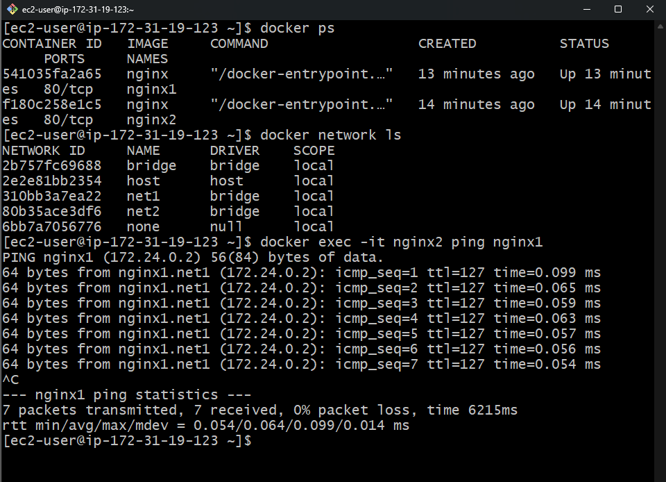

## Section 1: Docker Basics

1. When you run docker run -d nginx and immediately execute docker ps -a , the container shows as Exited (0). What’s the most likely reason?  
ans c) The container exited because no foreground process was running  

2. What will happen if you execute:  
docker run --name webapp -p 80:80 nginx  
docker run --name another-webapp -p 80:80 nginx  
ans b) The second command will fail due to port conflict  

3. You execute:  
docker run -it ubuntu bash  
After exiting the container using exit , what will be the state of the container?  
ans b) Exited  

4. Which flag ensures a container removes itself automatically after it stops?  
ans b) --rm  

5. You start a container with:  
docker run -d --name demo ubuntu sleep 1000  
docker exec demo touch /tmp/testfile  
docker commit demo myubuntu  
If you create a new container using myubuntu image, will /tmp/testfile exist?  
ans b) No  

6. What is the difference between ENTRYPOINT and CMD when using docker run with extra arguments?  
ans d) ENTRYPOINT keeps its command fixed, while CMD provides default arguments  

---

## Section 2: Dockerfile

1. Which Dockerfile instruction does not create a new image layer?  
ans c) WORKDIR  

2. You write the following Dockerfile:  
FROM ubuntu  
RUN mkdir /app  
COPY . /app  
RUN cd /app && touch file.txt  
After building, does /app/file.txt exist in the image?  
ans a) Yes  

3. Build a Dockerfile that installs Nginx and echoes “Deployed” when the container starts. Which of the following works correctly?  
ans b)  
FROM nginx  
ENTRYPOINT ["echo", "Deployed"]  

4. The .dockerignore file helps to:  
ans b) Prevent files from being copied during the build context upload  

5. What happens when a Dockerfile contains multiple CMD instructions?  
ans c) Only the last one takes effect  

6. You build an image with this Dockerfile:  
FROM ubuntu  
RUN echo "1" > /file  
RUN echo "2" > /file  
After running a container from it and checking /file , what will you see?  
ans b) 2  

---

## Section 3: Docker Networks

1. By default, Docker creates which three types of networks automatically?  
ans b) bridge, none, host  

2. Which network driver allows containers on different hosts to communicate directly?  
ans a) overlay  

3. You create two containers:  
docker run -d --name c1 nginx  
docker run -d --name c2 nginx  
Can c1 ping c2 by name?  
ans a) Yes  

4. When you create a network using:  
docker network create mynet  
What is the default network driver?  
ans a) bridge  

5. Which command connects an existing container to a new network?  
ans c) docker network connect  

6. You have two containers connected via a custom bridge network. If one container runs a web server on port 5000, how can the other container access it?  
ans a) By container name and port 5000  

---

## Section 4: Docker Compose

1. What is the default project name when you run docker-compose up without specifying p ?  
ans a) The name of the current directory  

2. In a docker-compose.yml , what does the depends_on key do?  
ans b) Ensures the dependent container is fully ready before start  

3. In docker-compose.yml , you remove a service and run docker-compose up -d . The old container is still running. Why?  
ans b) You need to use docker-compose up --remove-orphans  

4. Which command shows all running containers from a compose project?  
ans c) docker-compose ps  

5. Where does Docker Compose store its default network?  
ans b) Creates <project>_default network  

6. When you define the same volume in multiple services in docker-compose.yml , the data is:  
ans b) Shared among all containers  

---

## Section 5: Docker Volumes

1. Which type of volume is managed entirely by Docker?  
ans a) Named volume  

2. You create a container:  
docker run -v /data --name c1 ubuntu  
docker exec c1 touch /data/file1  
docker run --volumes-from c1 ubuntu ls /data  
Will you see file1 ?  
ans b) No  

3. Difference between bind mount and named volume?  
ans c) Bind mount can map to any host path, named volume is managed by Docker  

4. Which command removes unused volumes?  
ans a) docker volume prune  

5. You mount a host directory /app to container /data and create a file inside the container. If you stop and remove the container, what happens to the file?  
ans b) Remains on the host  

6. What happens when you run:  
docker run -v myvol:/data busybox  
docker volume ls  
ans d) Command fails  

---

## Practical Task

Create two containers in two different user-defined networks. The containers should be able to communicate with each other.

first of lauch a ec2 instance and then take ssh of the instance after that install docker in it

then we have to create 2 networks

docker network create net1  
docker network create net2  

after that run 2 container with nginx

docker run -d --name nginx1 --network net1 nginx  
docker run -d --name nginx2 --network net2 nginx  

then we have to connect the container 2 with the net 1 then they both an communicate with each other 

docker network connect net1 nginx2  

if you want to ping in both container then we have to install ping in  both container

docker exec -it nginx1 bash  
apt update && apt install -y iputils-ping  

docker exec -it nginx2 bash  
apt update && apt install -y iputils-ping  

thats all done we can do test connectivity  
docker exec -it nginx2 ping nginx1  

 